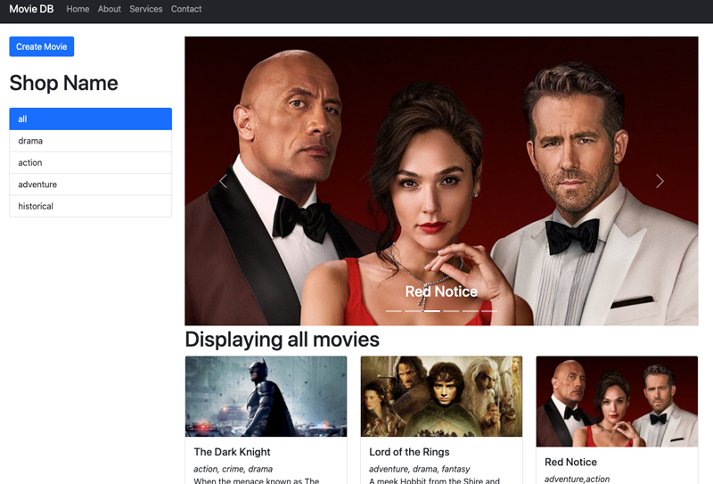

# Movie Application

A simple serverless movie application, that allows you to add, delete and update movie.


## Getting Started

First, run the development server:

```bash
npm run dev
# or
yarn dev
```



## Built With

- NextJS

## Live Demo
[Live Demo Link](http://uduakessien.com)

## Getting Started

```bash
 git clone https://github.com/acushlakoncept/moviedb.git

 cd moviedb

 npm install

 npm run dev
```

